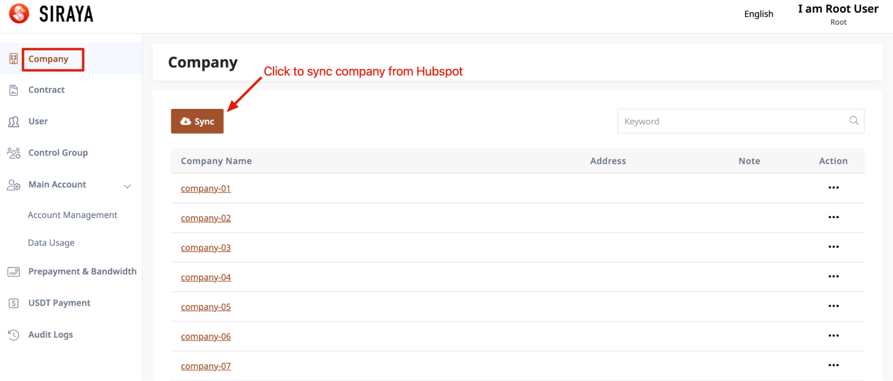
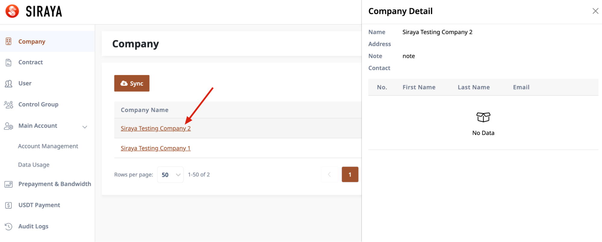

# 1.1.1 Company list

After the root account logins into the system, select "Admin service" and click "Company" menu

The screen displays all the company information from Hubspot. To update the latest data, click the "Sync" button

To view company details, click on company name

