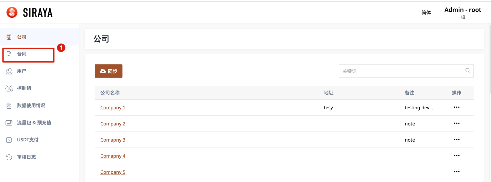
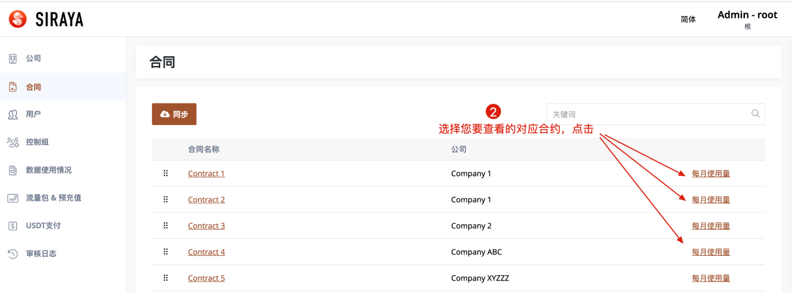
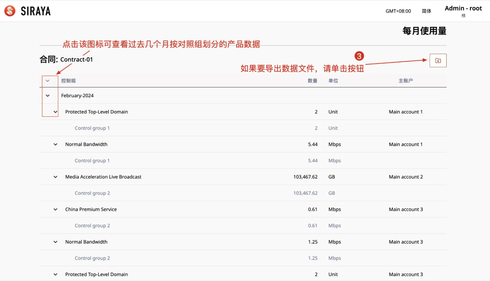
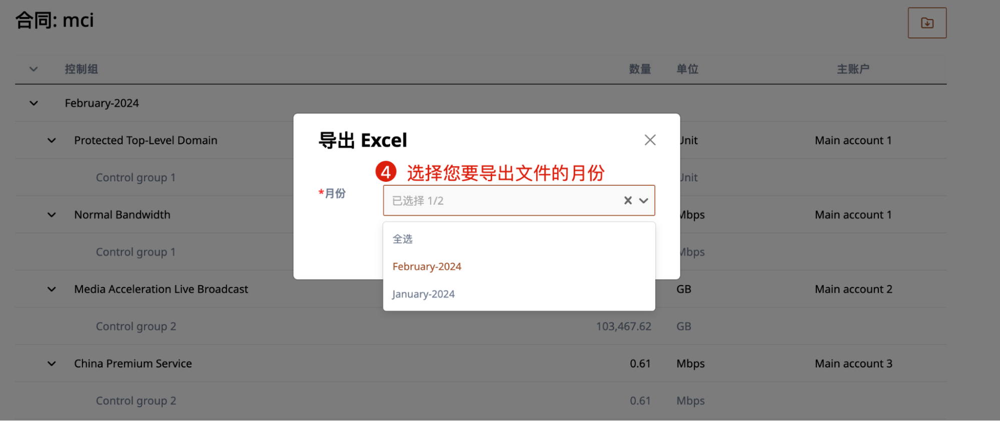
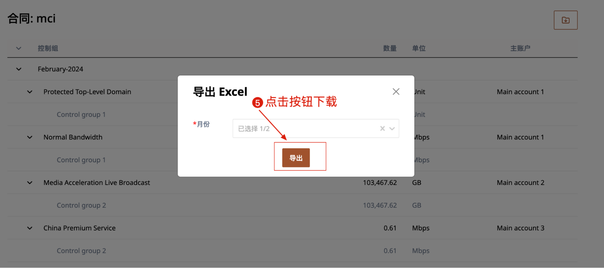

# 1.2.2 Monthly Usage

Administrators can view the data that the control group in the contract has used in the past months. The types of product names that can be viewed data are:

1."Normal Bandwidth"

2."Protected Top-Level Domain"

3."China Premium Service"

4."Content Acceleration"

5."Content Acceleration China Premium"

6."Dynamic Web Acceleration"

7."Dynamic Web Acceleration China Premium"

8."Media Acceleration Live Broadcast"

9."Media Acceleration Live Broadcast China Premium"

10."Media Acceleration - VoD"

11.“Domain Name”

If the contract has these product names, you can view the data, and vice versa, you cannot view the data when the contract does not have those product names.

