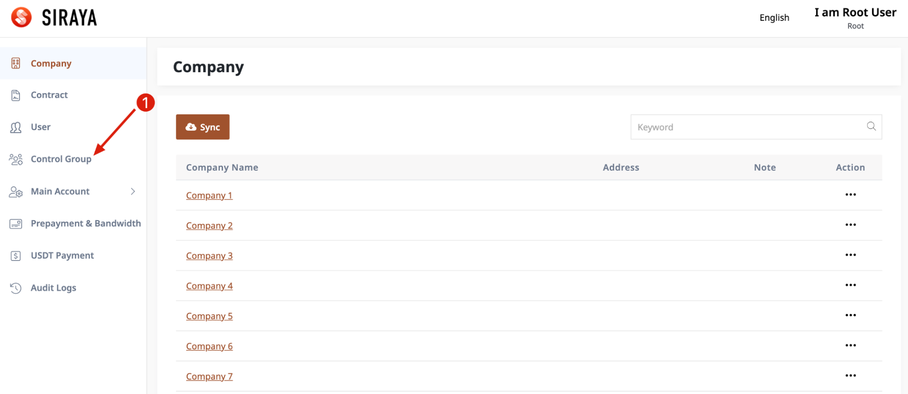
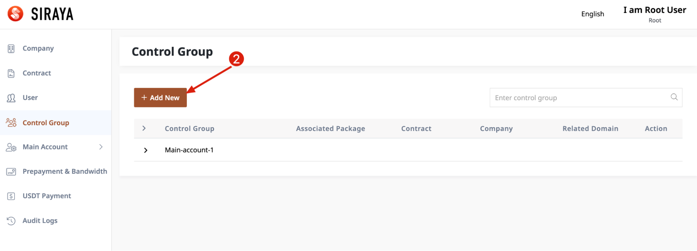
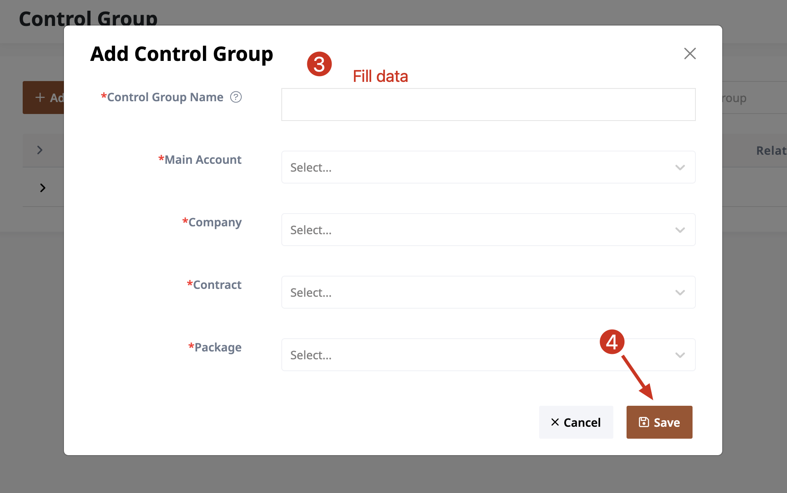
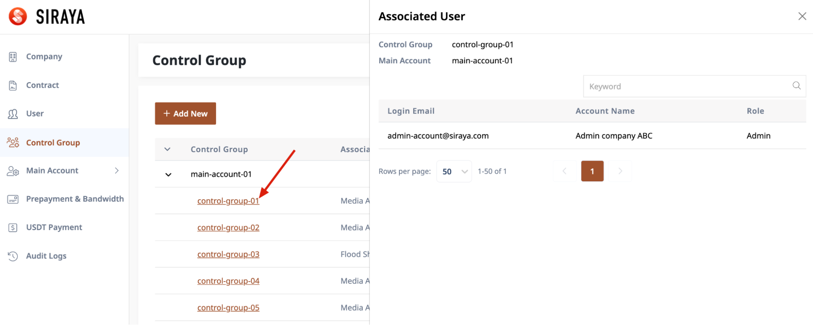

# 1.3.1 Add new control group

# Step 1

# Step 2

# Step 3

After creating a control group, users can be associated with it. To view which users already associate, you can click on the control group name to view details.

