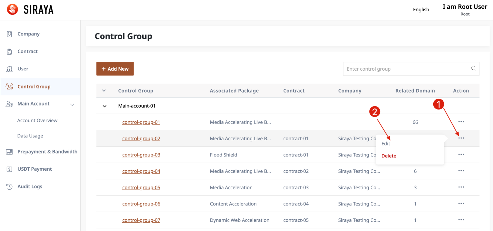
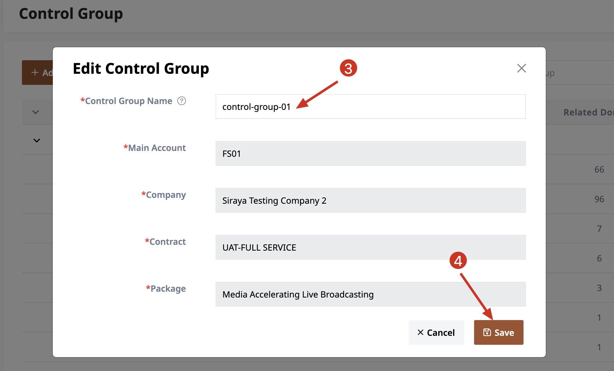

# 1.3.2 Edit control group

# Step 1

# Step 2

In case the control group contains domain names, you can only edit the control group name.
When the control group is synchronized - no contract or company, you can update company and contract.
