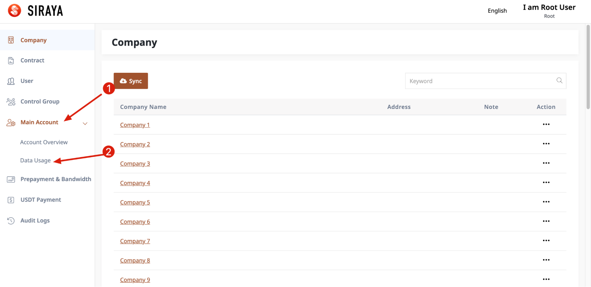
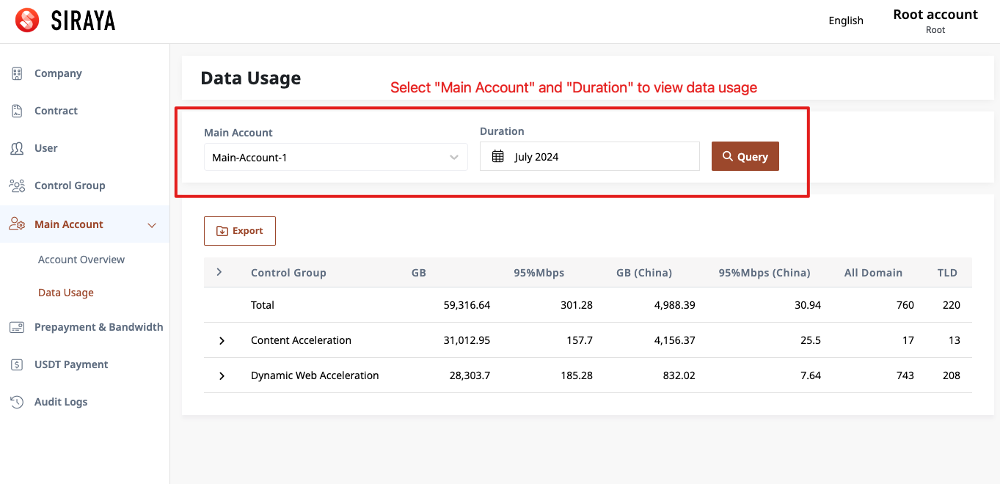
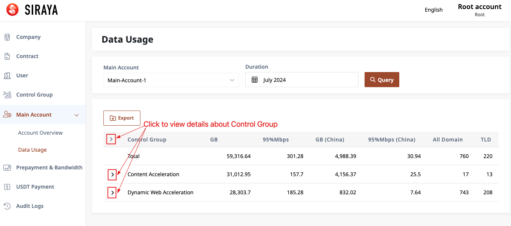
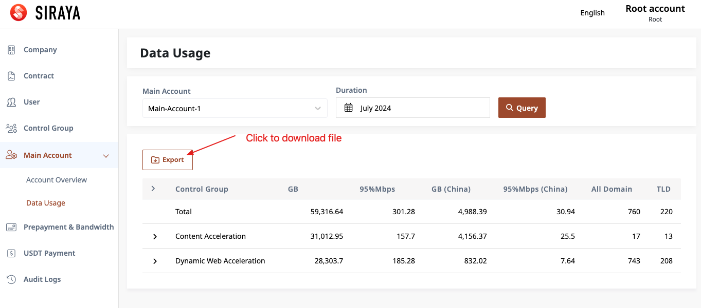

# View data and export file

Administrators can view the data that the main account has used in the past months. The types of data that can be viewed are: GB, 95%Mbps, GB (China), 95%Mbps (China), All Domain, TLD (Top-level Domain)

