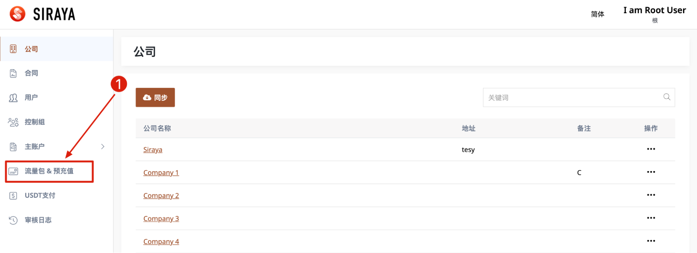
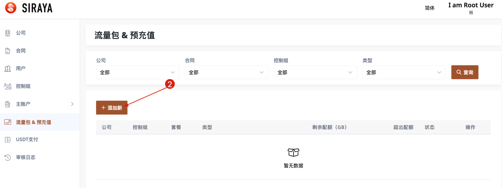
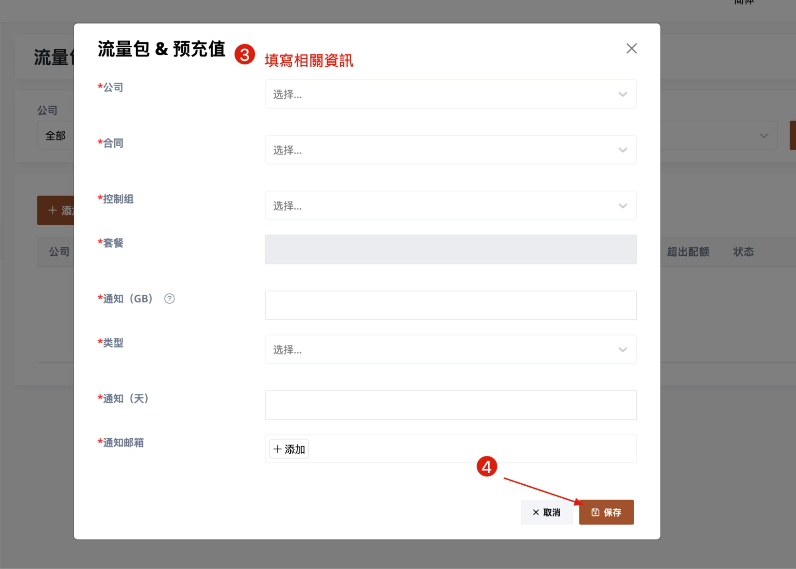

# 1.7.1 Add new record
Create a "Prepayment & Bandwidth" record for Control Group. This record contains the setting information of the **GB** or remaining days of the purchased "Data Pack & Precharge" package. If the purchase package reaches this date, the system will send an email to the user. 

# Step 1

# Step 2

# Step 3

After the record is created, it will appear on the user page.
