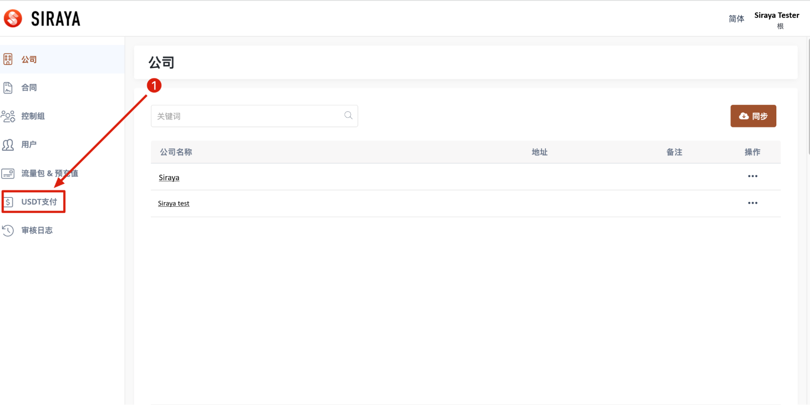
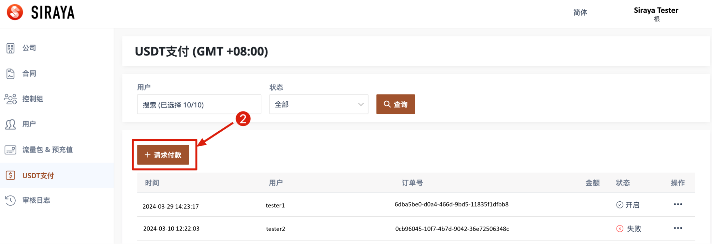
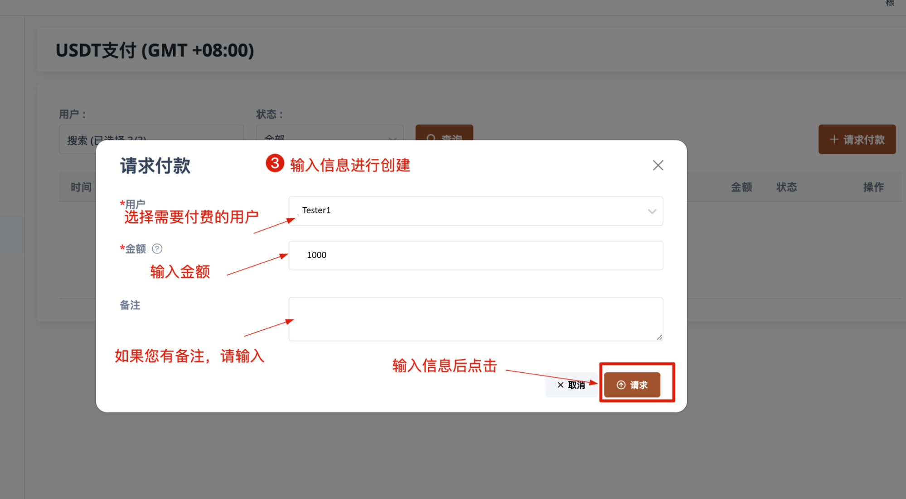

# 1.2.1 Add new record

Instruct to create USDT payment records for users

# Step 1
Log in to the management system and select the appropriate tab

# Step 2

# Step 3

After the record is created, it will appear on the user page.
