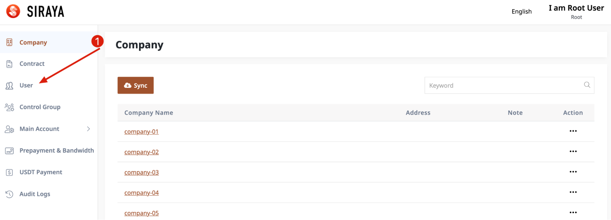
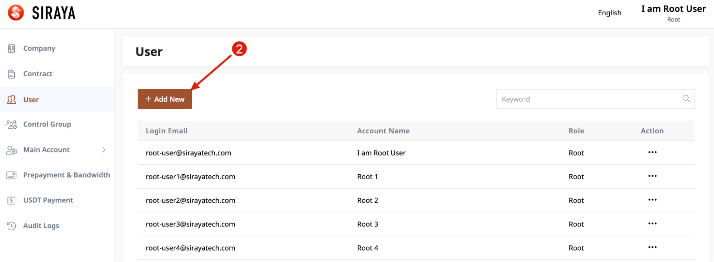
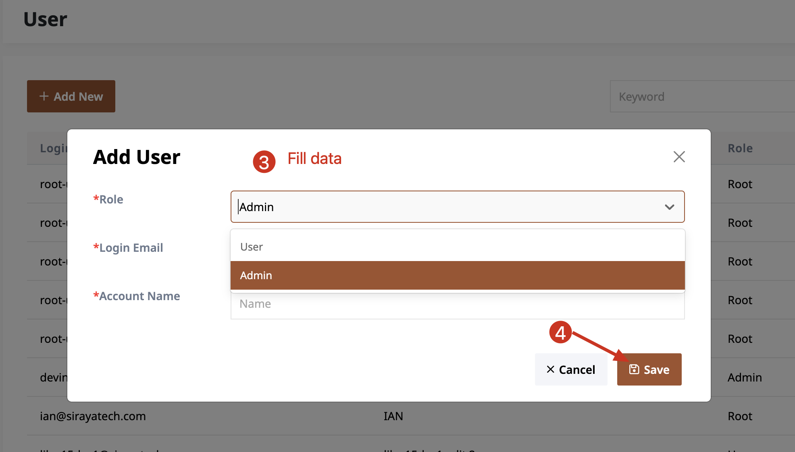

# 1.4.1 Create user
Root account has highest privileges, can create admin accounts or user accounts.
An admin account has higher privileges than a user account. It can manage the user accounts that belong to it.

# Step 1

# Step 2

# Step 3

You (root account) can create admin accounts or user accounts.
After creating a new account, a mail will be sent to both you and the new account you have just created.
