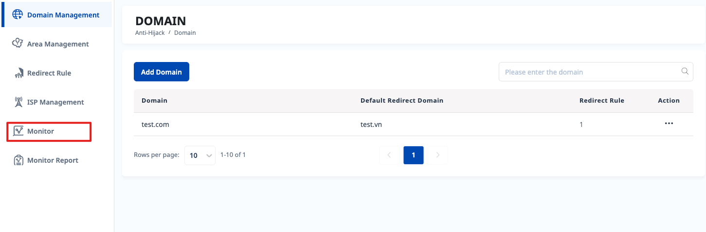
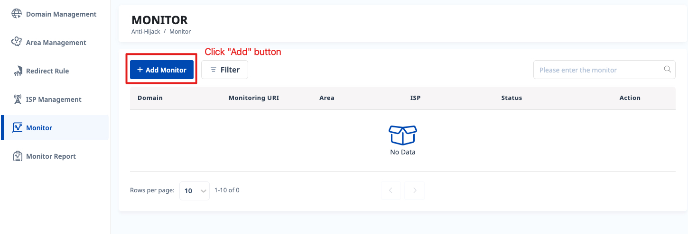
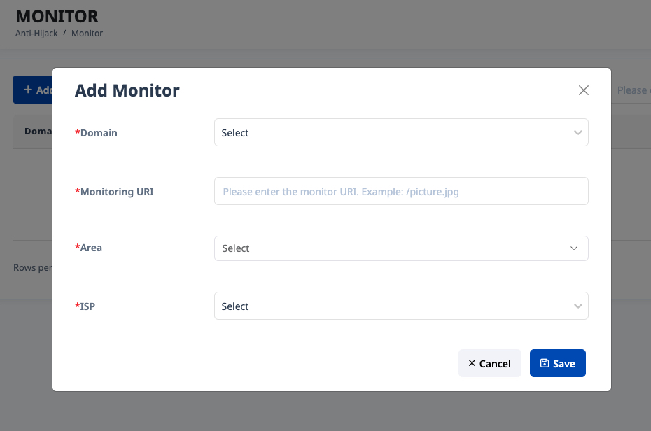
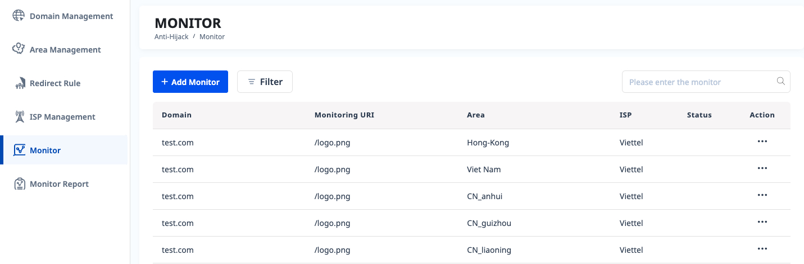

# 2.7.5.1 Add Monitor

# Step 1

Select "Monitor" menu on the left screen.

# Step 2

# Step 3

Fill full data and submit. When adding a monitored URI, you can select multiple areas

When you add multiple area at once, there will be a corresponding number of records, as same as on below screen

