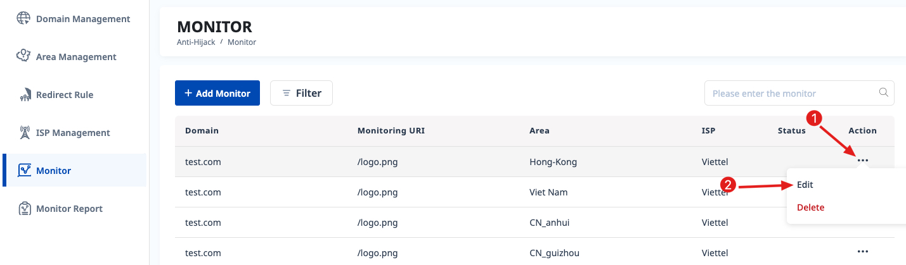
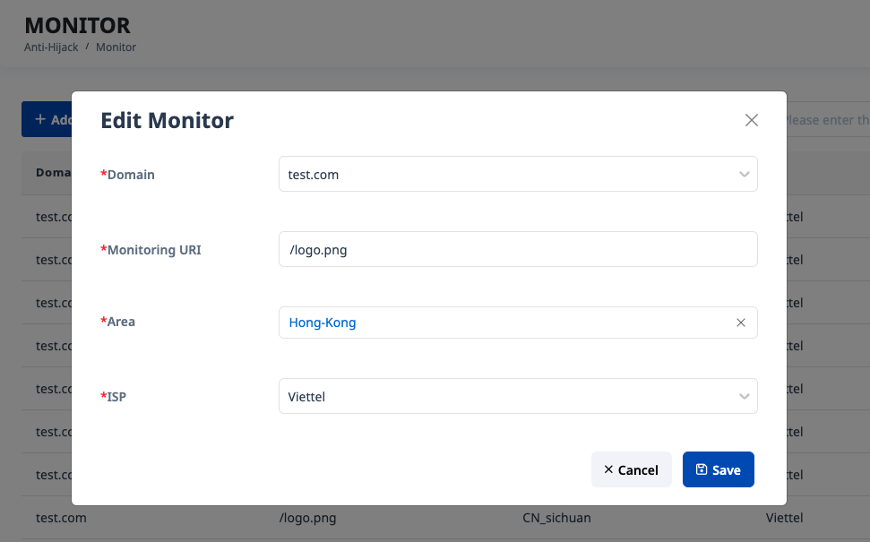

# 2.7.5.2 Edit Monitoring URI

After adding a monitoring URI, you can edit it.

# Step 1

# Step 2

When adding a monitored URI, you can select multiple areas, but when editing, you can only select one area. Change data and click "Save" button to submit

