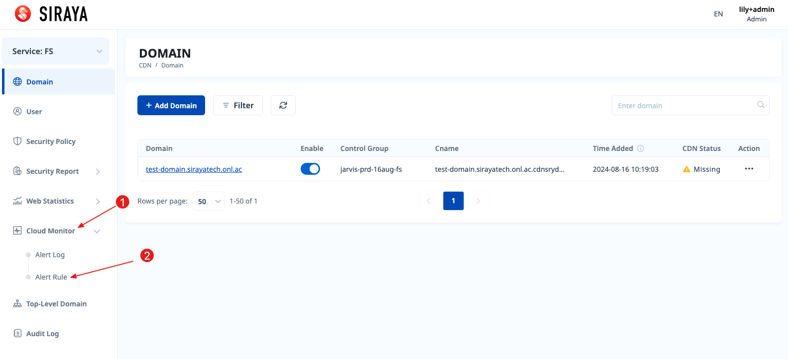
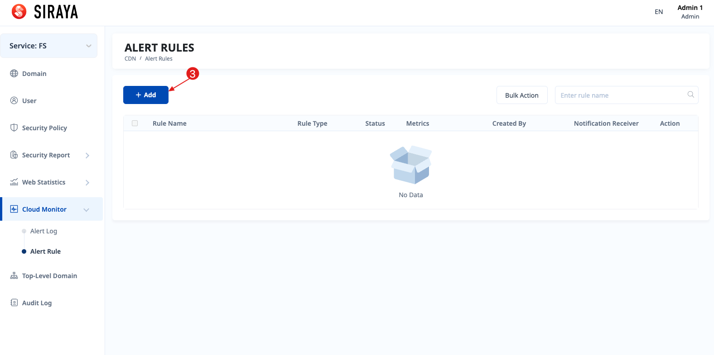
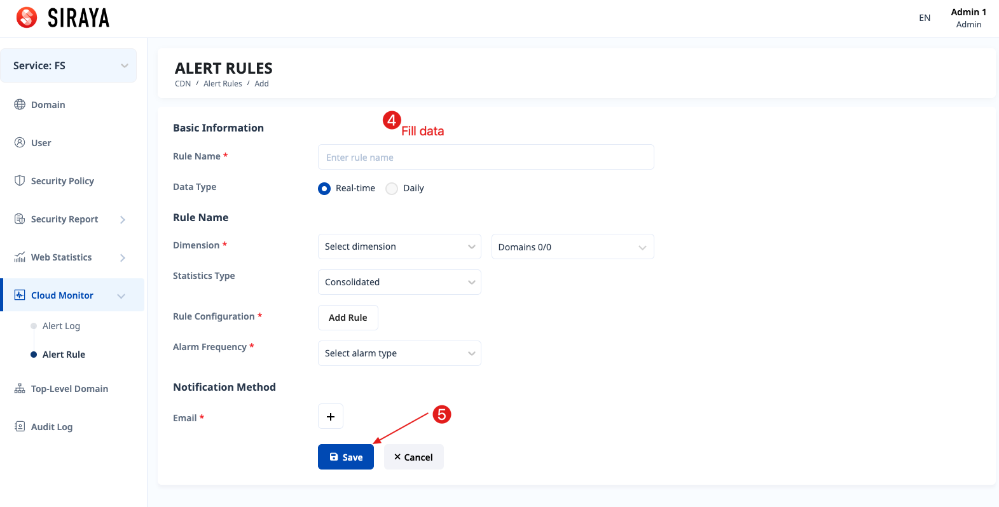
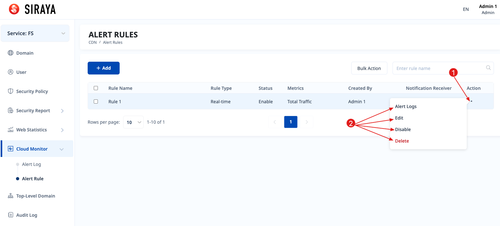
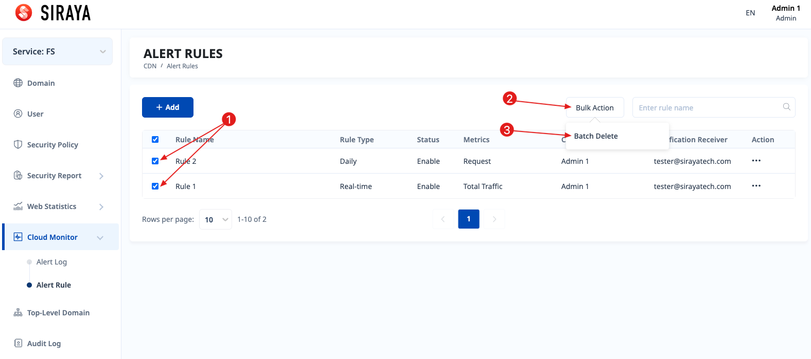

# 2.1.4.1 Add rule

You can set up a rule to receive alerts about usage thresholds of domains.

# Step 1

# Step 2

# Step 3

When the domains reach the conditions you set, an email will be sent to your email. And also log a record at the "Alert log" menu.

You can edit, disable/enable, view logs or delete after creating a rule.

If you have multiple cache rules and you want to delete them all, you can follow these instructions.

