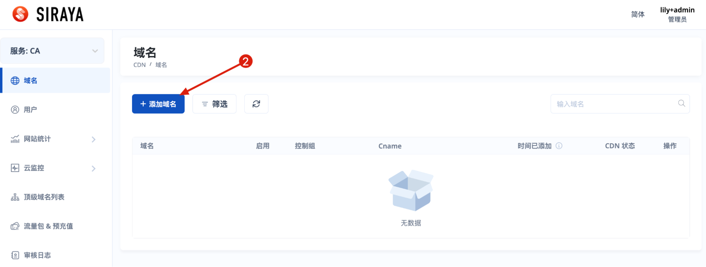
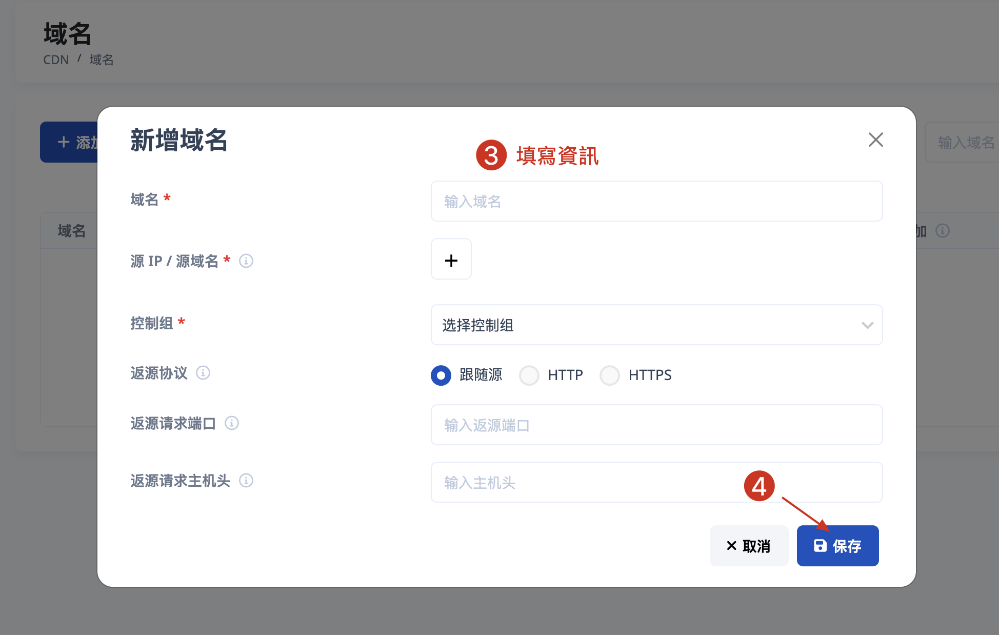
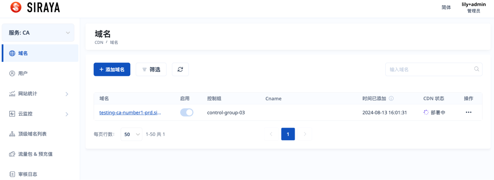
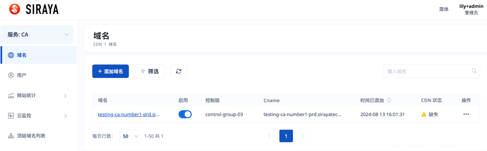

# 2.1.1.1 Add domain

When the account is associated with the control group corresponding to the service, for example Flood Shield. You will select this service on the home screen after logging in.

Flood Shield (FS), Content Acceleration (CA), Dynamic Web Acceleration (DWA) and Media Acceleration (MA) domains have same form to add domain.

# Step 1

Hover on the "CDN" part and select the service.

# Step 2

# Step 3

Fill full data and submit

After adding a new domain, the domain is displayed as same as on below screen:

After the domain is finished deployment:

