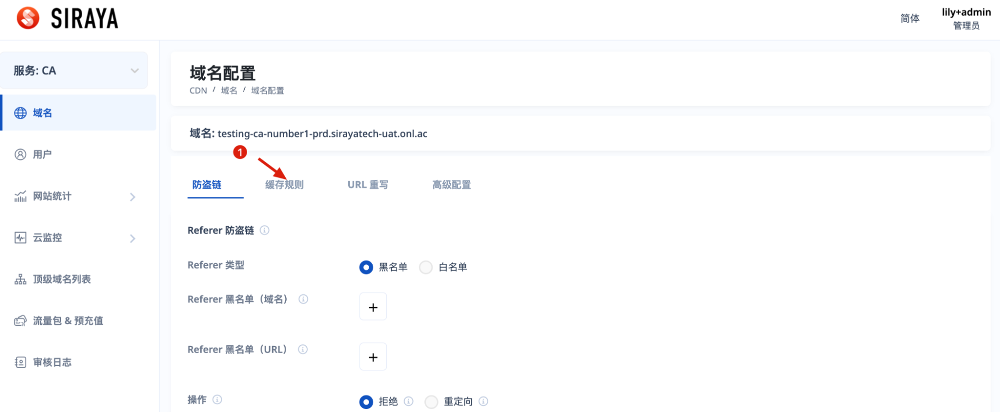
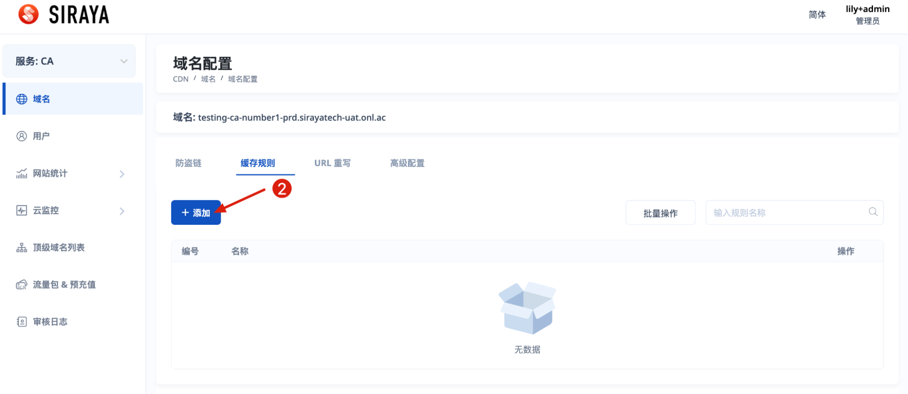
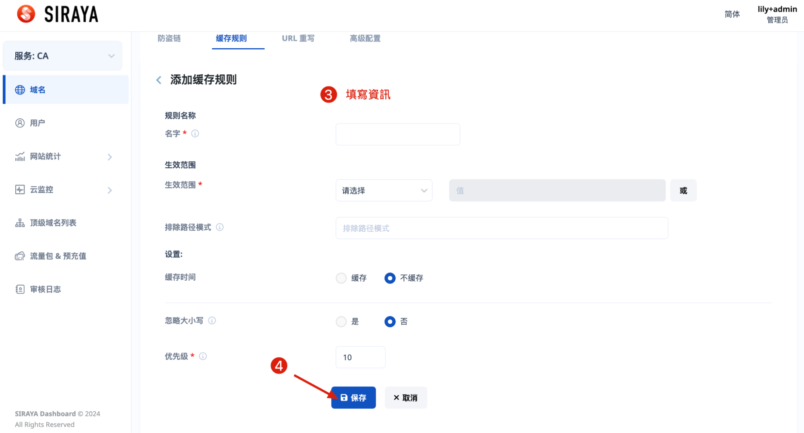
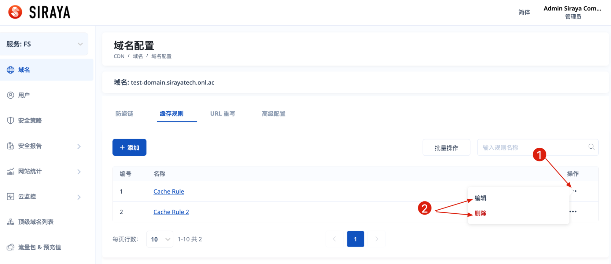
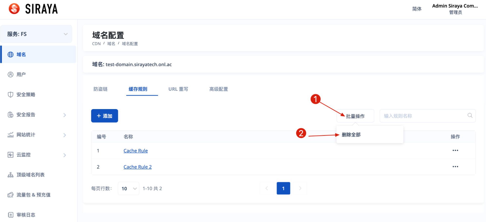

# 2. Set Cache Rule

# Step 1

# Step 2

# Step 3

You can edit or delete after creating a configuration.

If you have multiple cache rules and you want to delete them all, you can follow these instructions.

