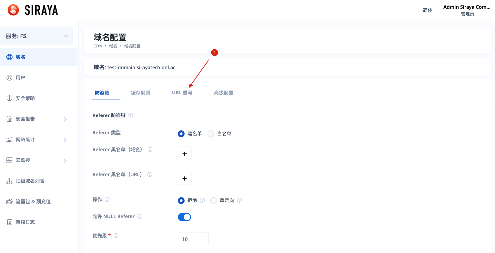
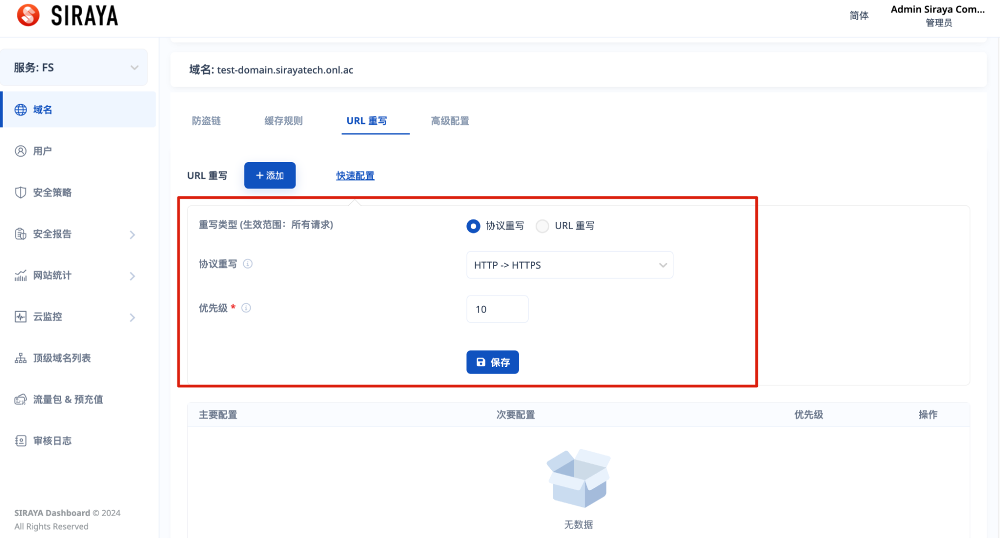
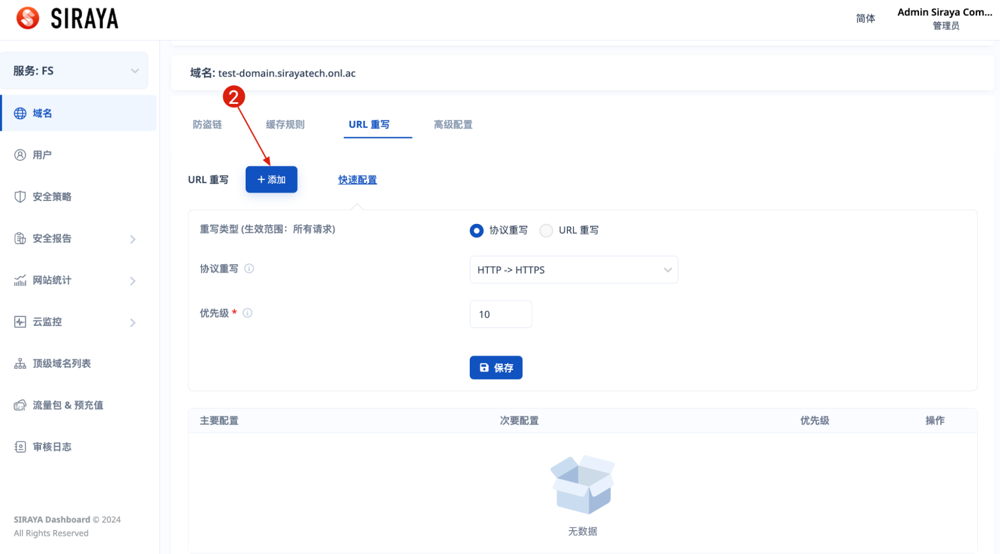
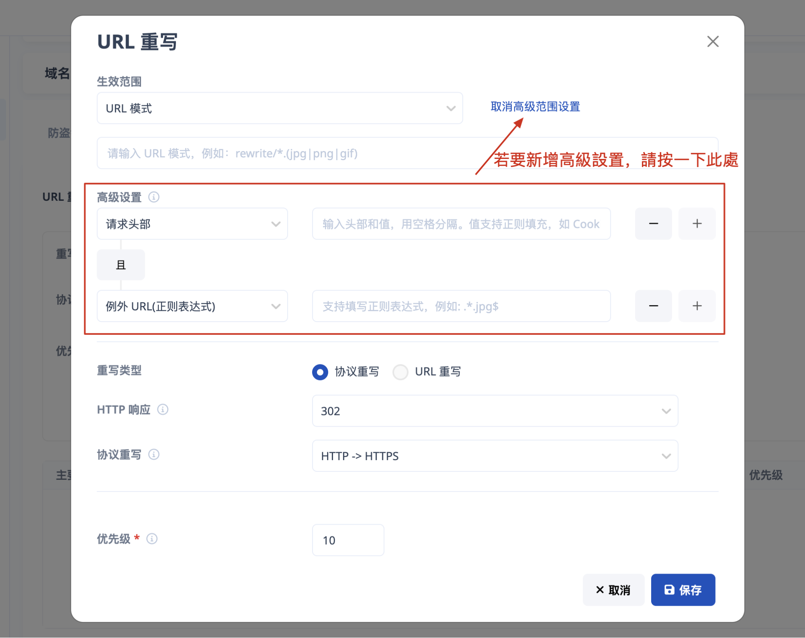
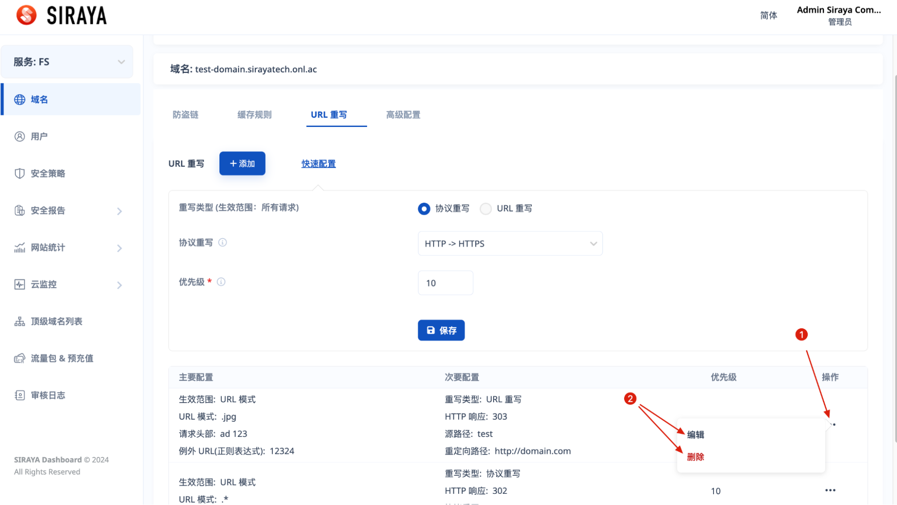

# 3. Set URL Rewrite

# Step 1

# Step 2

To quickly add a URL rewrite rule, you can fill in the information and submit it in the area as shown in the image.

To create a rule with more complete configuration, please follow the instructions below:

# Step 3

If you create a rule with more complete configuration, fill full data and submit.

You can edit or delete after creating a configuration.

