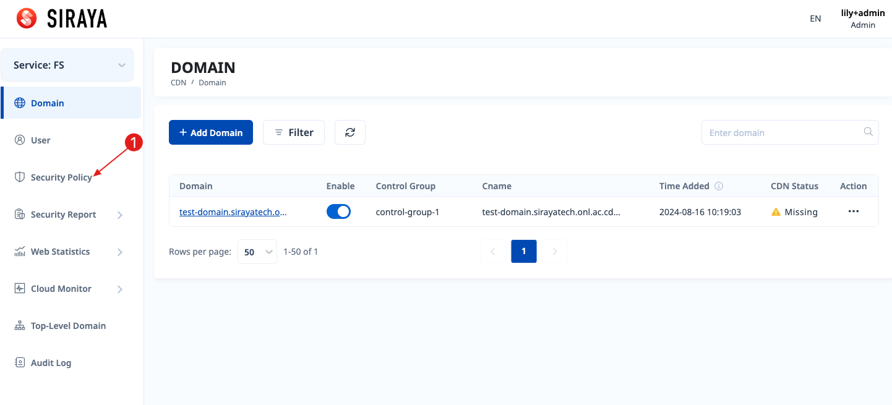
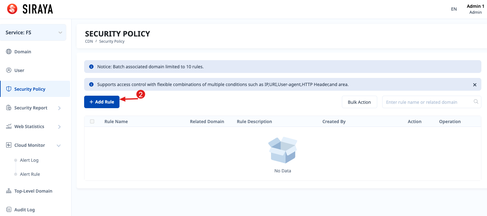
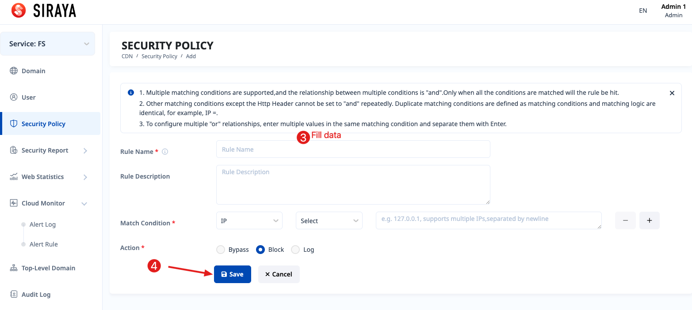
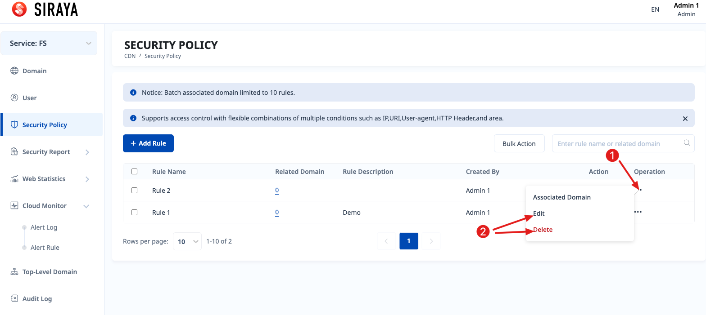

# 2.1.5.1 Add rule

This feature is used when the service is Flood Shield. Both Admin account and user account can use this function.

# Step 1

# Step 2

# Step 3

You can edit or delete after creating a rule.

