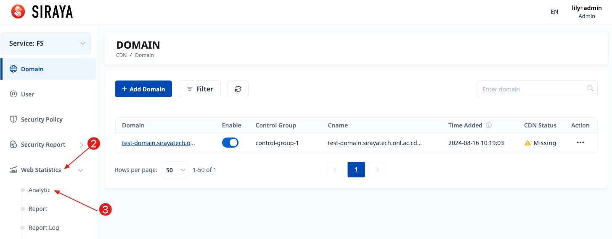
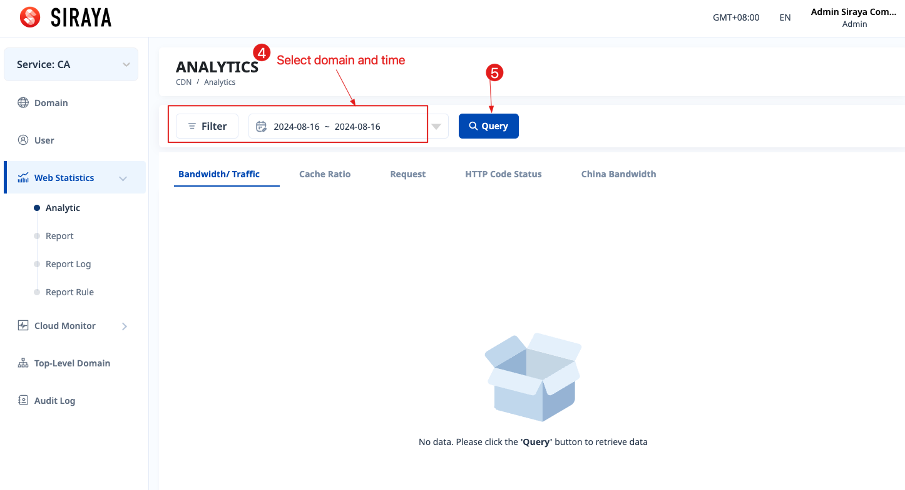

# 2.1.3.1 Analytics

Users can view the amount of data used according to the domain. Depending on the type of service, there will be corresponding charts.

The data types that can be viewed are:
Bandwidth,
Traffic,
Cache Ratio,
Request,
HTTP Code Status,
China Bandwidth,
Unique Visitors,
IP.

# Step 1

Hover on the "CDN" part and select the service.

# Step 2

# Step 3

Select type data you want to view by clicking on the corresponding tab, example: Bandwidth/ Traffic.

You can change GMT between GMT+00 and GMT+08. After changing GMT, you need to query again.

