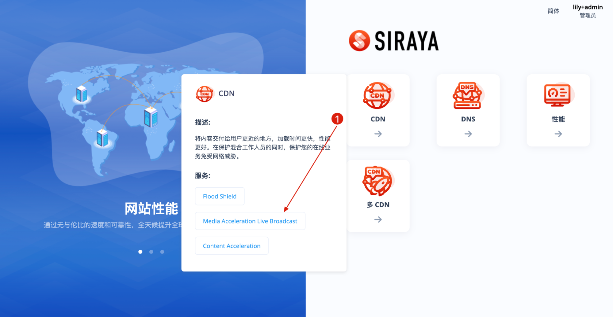
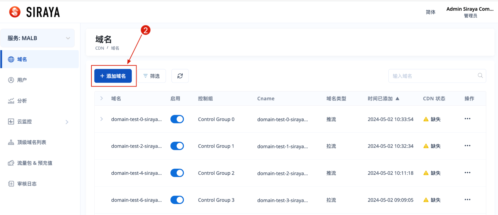
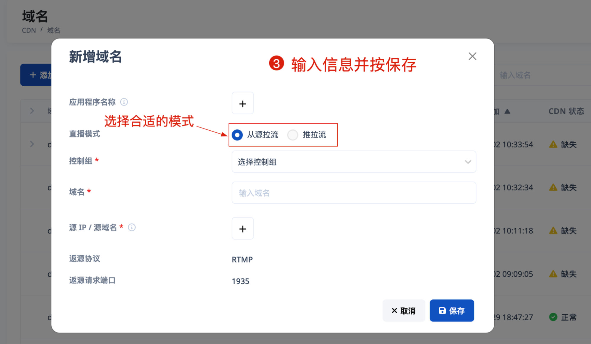

# 2.3.1 Add domain

When the account is associated with the control group corresponding to the service, for example Media Accelerating Live Broadcasting. You will select this service on the home screen after logging in.

# Step 1

Hover on the "CDN" part and select the service.

# Step 2

# Step 3

Fill full data and submit.

