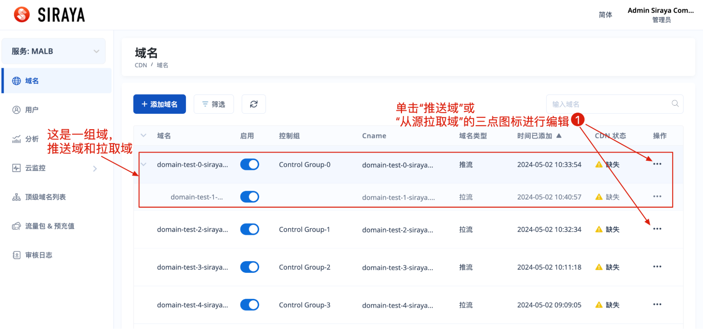
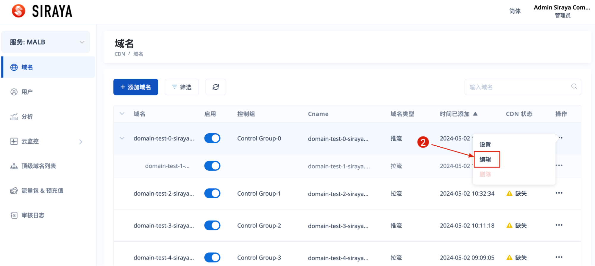
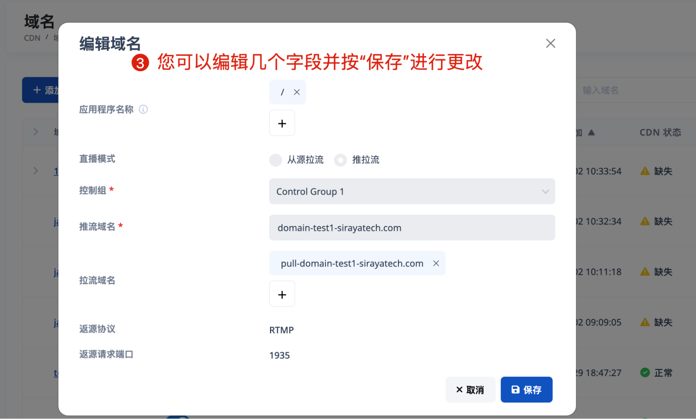

# 2.3.2 Edit domain

After completing the deployment process, you can edit the domain. The domain you can edit is either a push domain or a pull domain created from Pull streams from origins mode.

# Step 1

# Step 2

# Step 3

Fill full data and submit. When you change application name of push domain, it will be effect for all pull domain below this push domain

