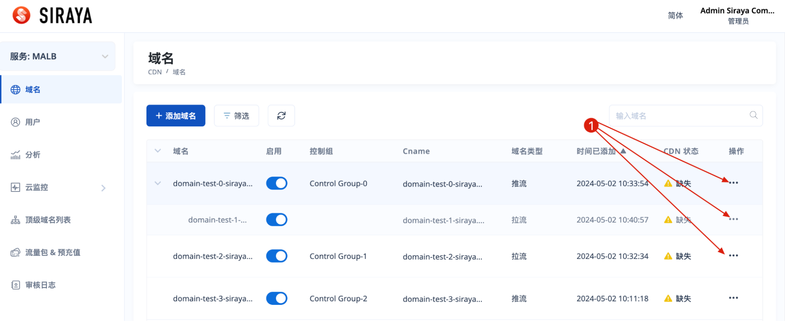
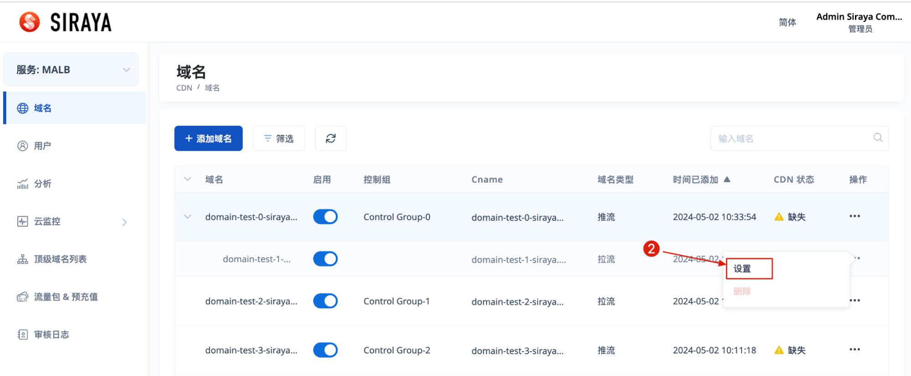
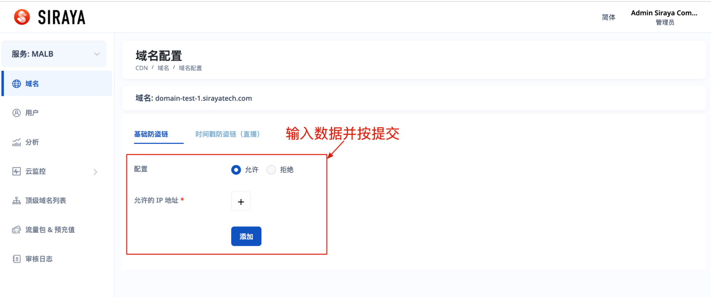
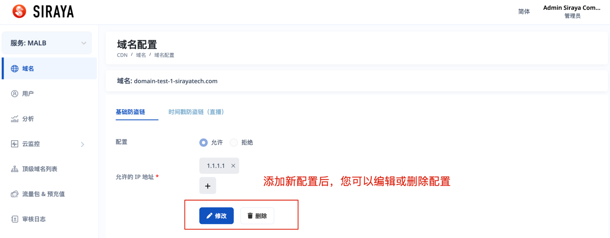
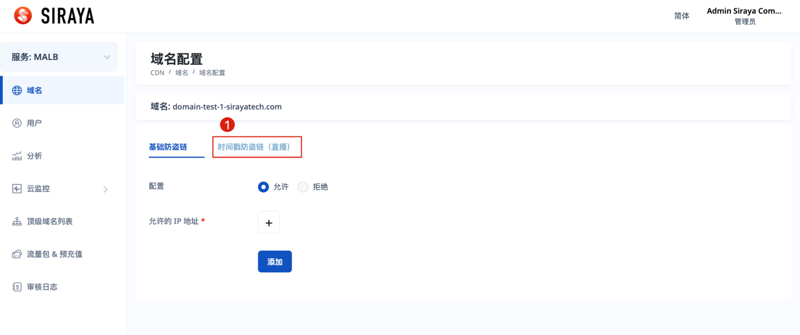
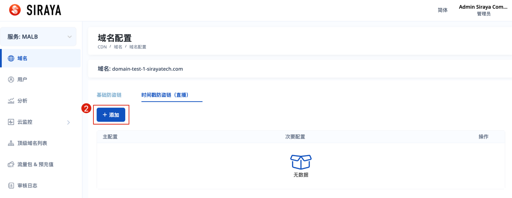
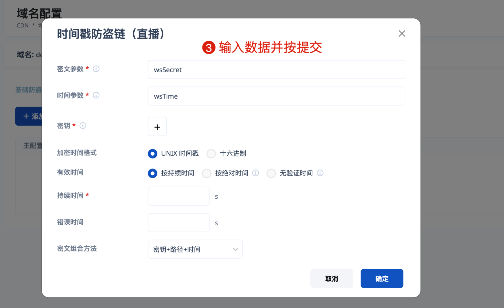
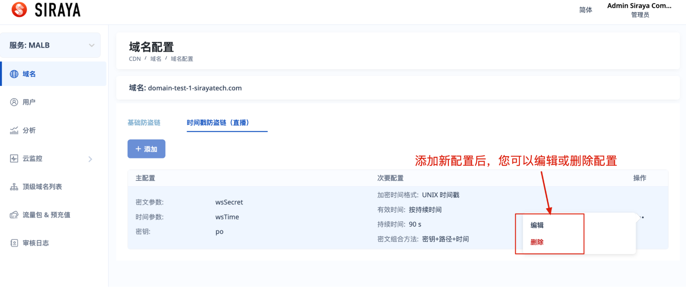

# 2.3.3 Set configuration

You can set configuration for each domain. There are 2 types of configuration you can set: Basic Anti-Hotlinking and Timestamp Anti-Hotlinking (Live)

# Step 1

# Step 2

# Step 3

**With Basic Anti-Hotlinking:**

You can edit or delete after creating a configuration

**With Timestamp Anti-Hotlinking (Live):**

Fill full data and submit

You can edit or delete after creating a configuration

