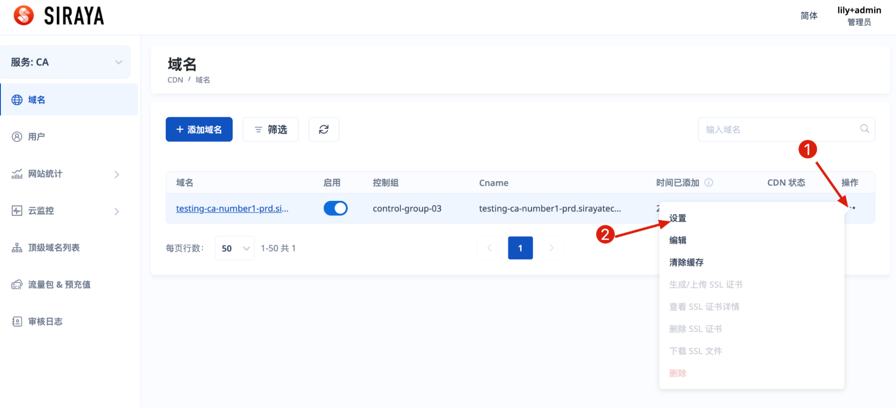
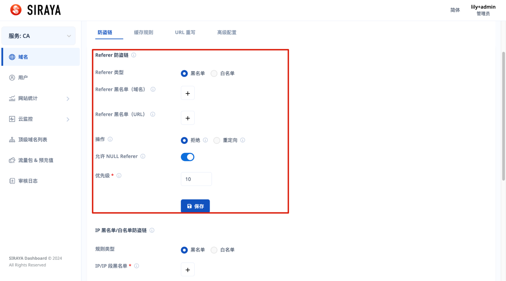
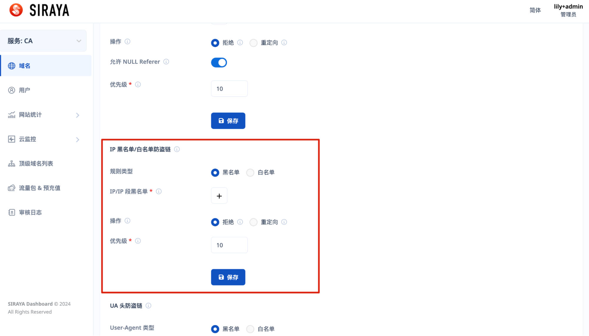
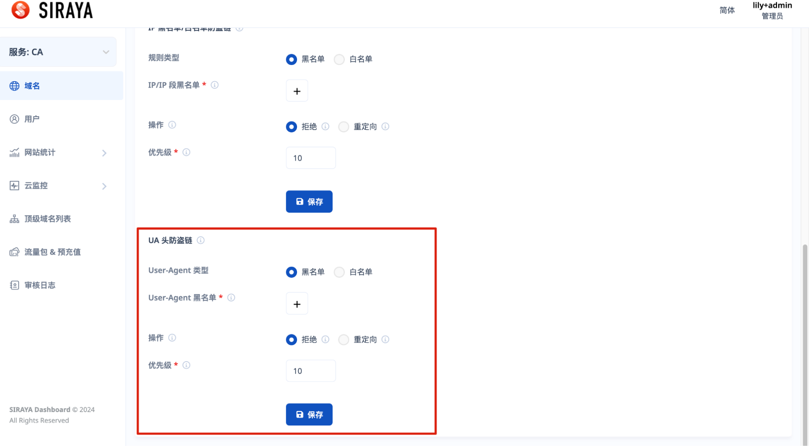

# 2.4.3.1 Set Anti-Hotlinking

# Step 1:

# Step 2:

Find type of  Anti-Hotlinking you want to set. There are 3 types of  Anti-Hotlinking: Referer, IP and UA.

**About Referer Anti-Hotlinking**

**About IP Anti-Hotlinking**

**About UA Anti-Hotlinking**

You can edit or delete after creating a configuration.

