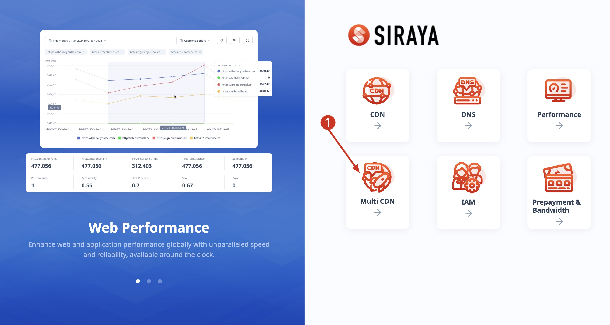

# 2.4.1 Create a new domain
Ensuring fast and reliable content delivery is paramount. Multi CDN (Content Delivery Network) solutions offer a strategic approach to optimize content delivery across diverse geographical locations. By leveraging multiple CDN providers simultaneously, organizations can mitigate risks of downtime, improve performance, and enhance user experience. To create a new domain, follow the below steps:

# Step 1

# Step 2

# Step 3

