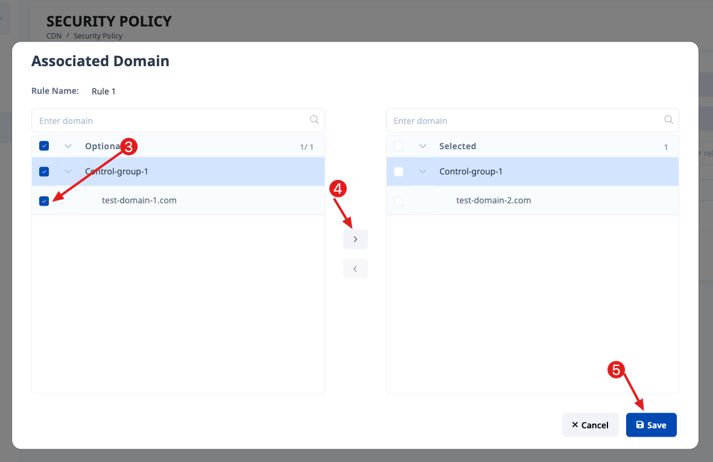
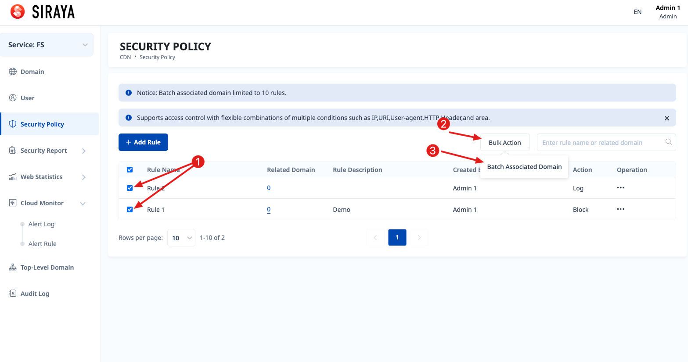
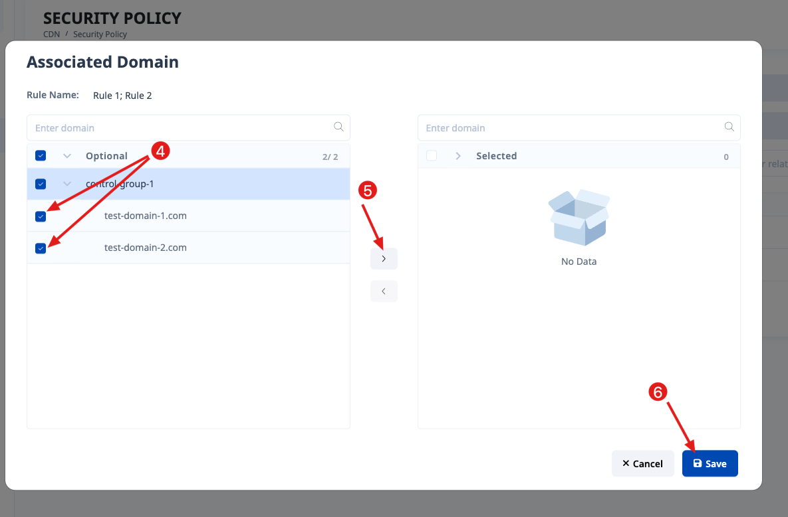
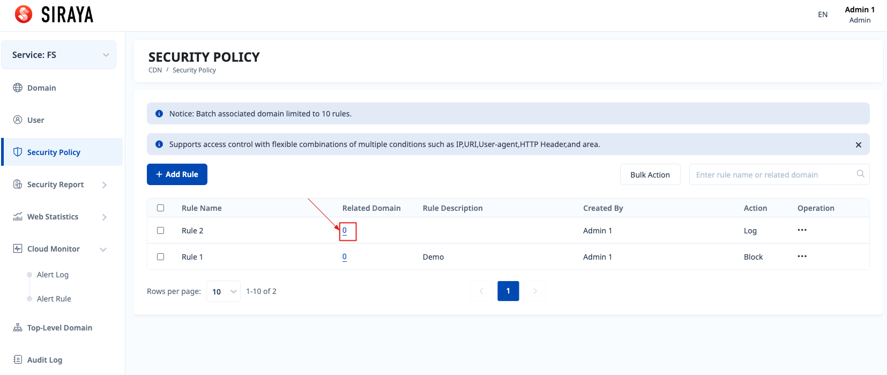

# 2.5.2 Associate domain

# Step 1:

To associate domain with 1 rule:

# Step 2:

# Step 3:

To associate domain with many rules:

# Step 4:

# Step 5:

To view which domains are associated with the rule, click on number in “Related Domain" column to view details.

