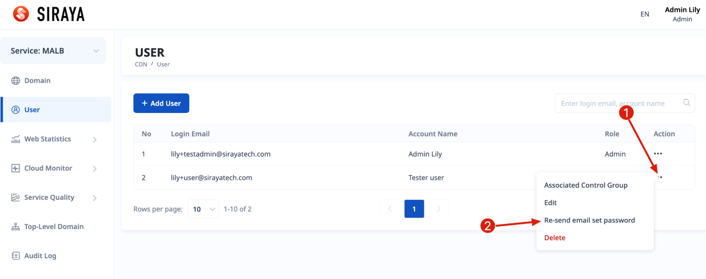

# 2.9.5 Re-send email set password

In case the first link to set password expired, you can click the option to resend another mail for the user. After setting the password, you can not use this feature.

