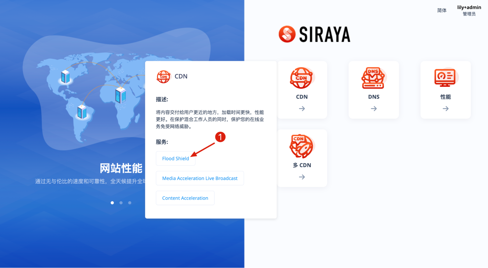
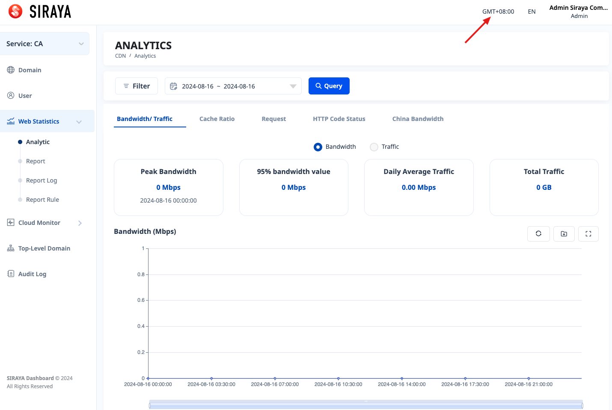

# 2.4.1 analytics

Users can view the amount of data used according to the domain

Depending on the type of service, there will be corresponding charts
The data types that can be viewed are:
Bandwidth
Traffic
Cache Ratio
Request
HTTP Code Status
China Bandwidth
Unique Visitors
IP

On the portal, charts can be viewed via an administrator account or a user account

Filter and view charts

# Step 1:

# Step 2:

# Step 3:

Select type data you want to view by clicking on the corresponding tab, example: Bandwidth/ Traffic.

You can change GMT between GMT+00 and GMT+08. After changing GMT, you need to query again.

