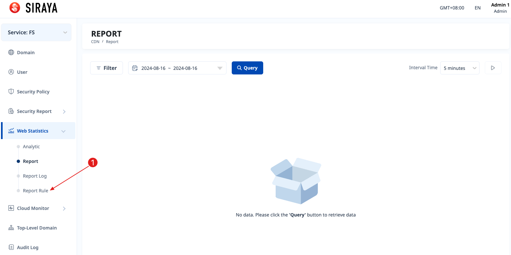
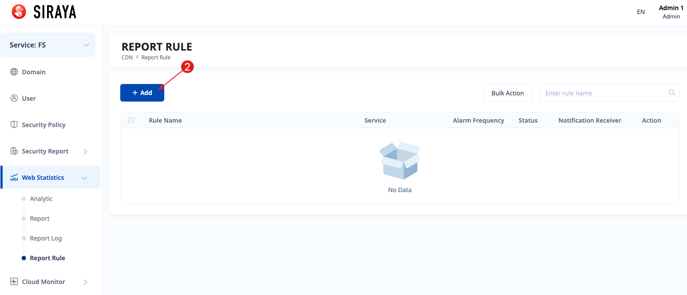
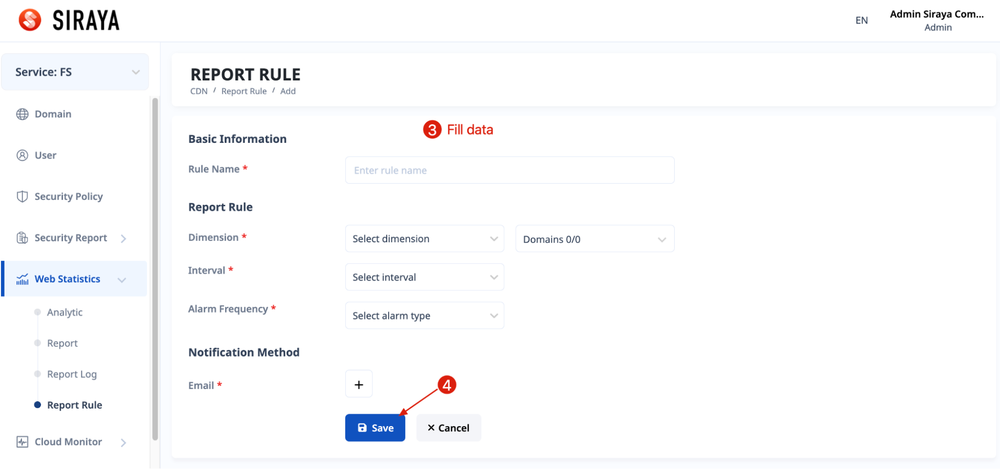
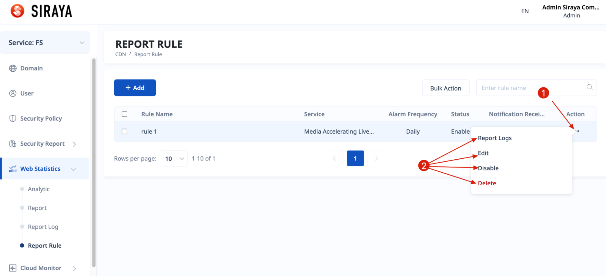
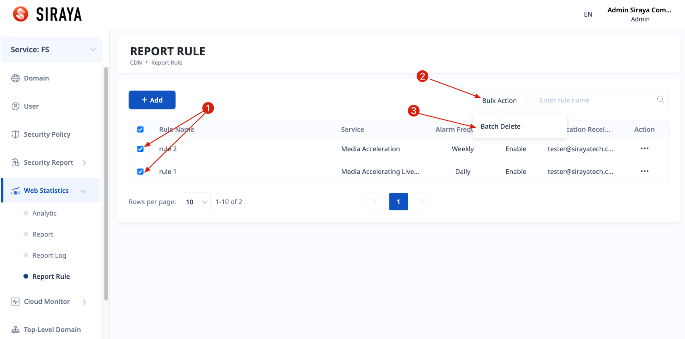
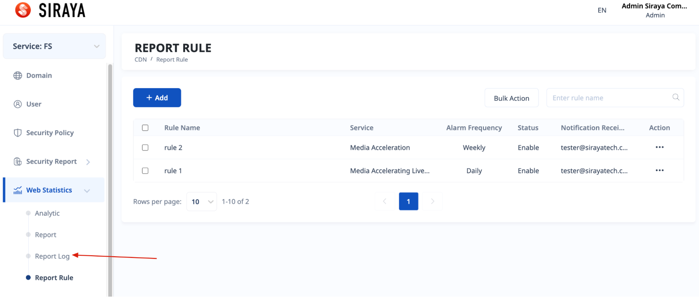
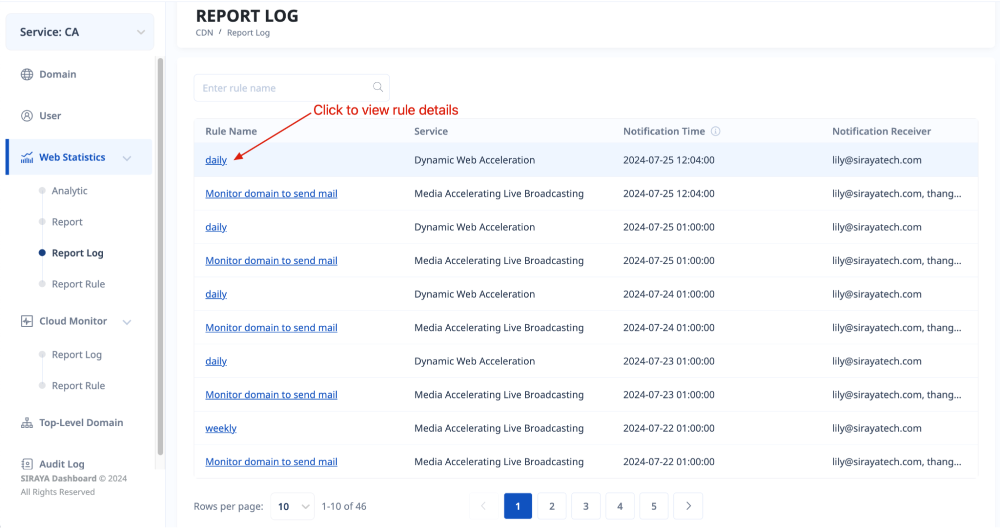

# 2.5.3 Report Rule

You can set up a rule to receive reports daily, weekly or monthly.
# Step 1

# Step 2

# Step 3

After you successfully create a rule, you will receive an email at 00:00 GMT +08 of the beginning of the day, beginning of the week, beginning of the month as you have set. And also log a record at the "Alert log" tab.

You can edit, disable/enable, view logs or delete after creating a rule.

If you have multiple cache rules and you want to delete them all, you can follow these instructions.

To view all logs about report log, click "Report log" menu

