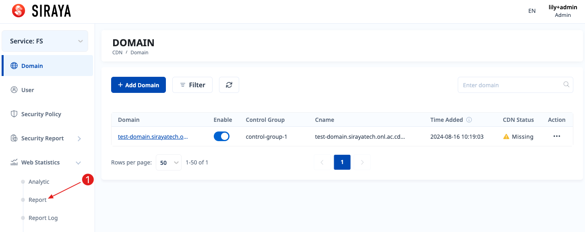
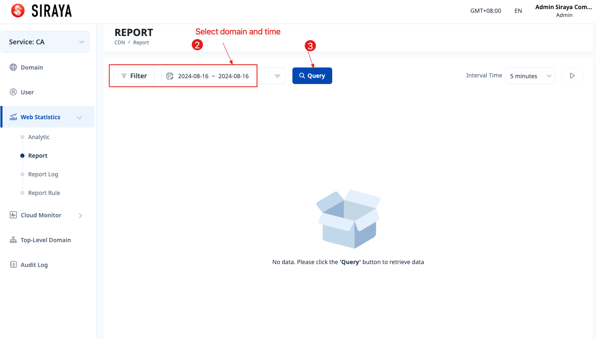
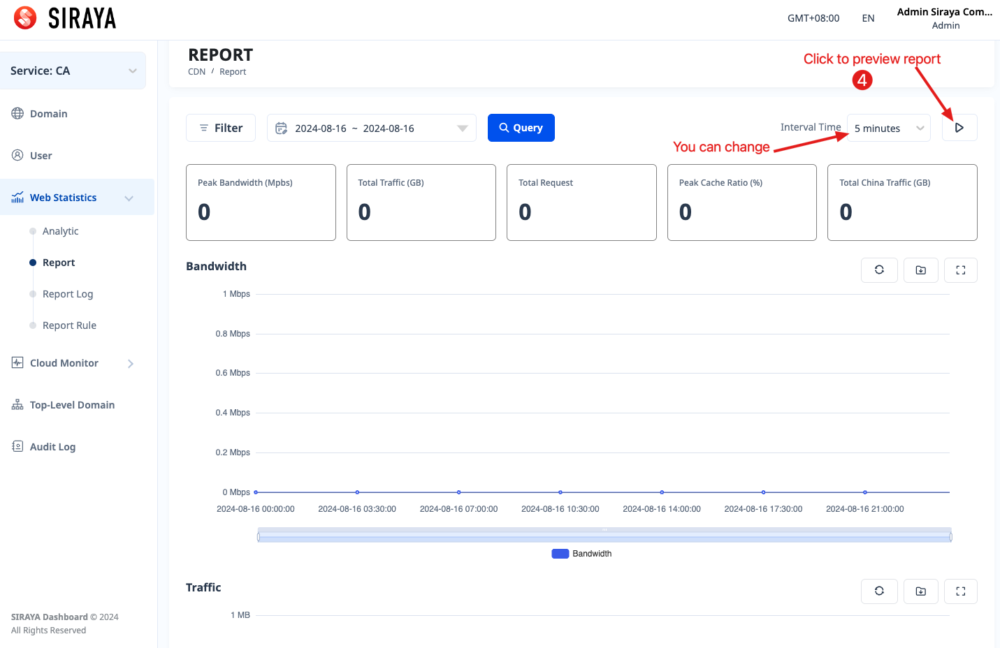
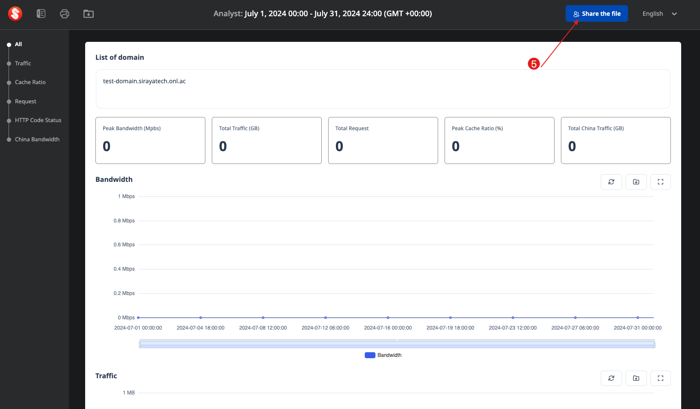
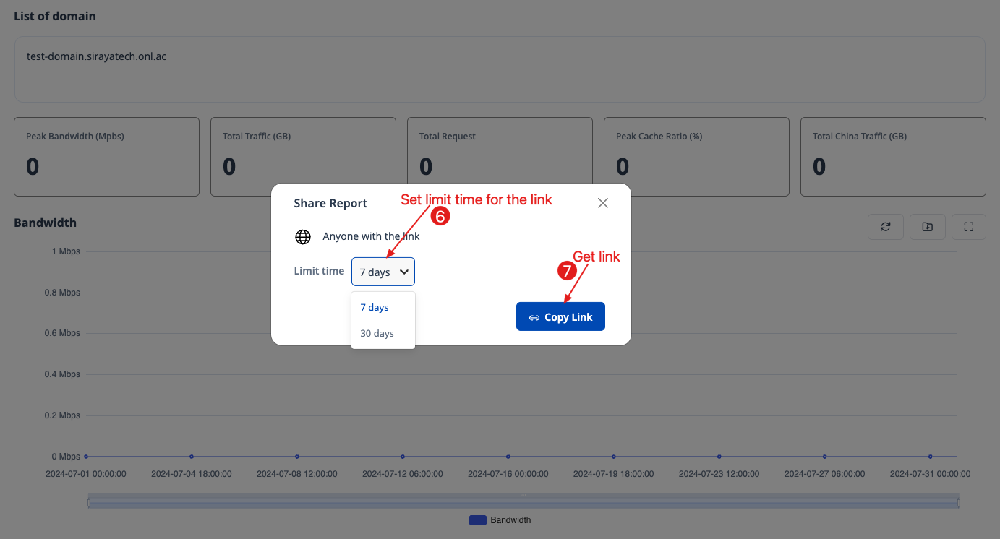

# 2.5.2 Report

Instead of viewing each chart in the "Analytic" menu, "Report" menu helps you view all charts with just one query. And you can share them with anyone. It provides great support for reporting.

# Step 1

# Step 2

# Step 3

# Step 4

# Step 5

