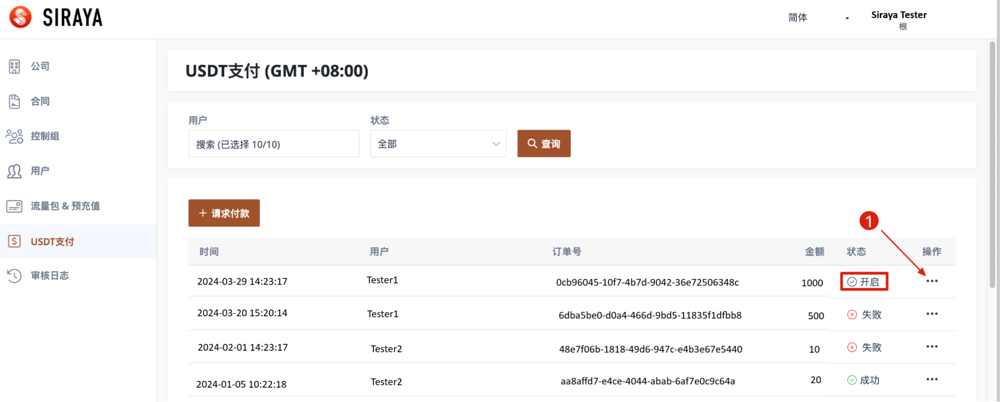
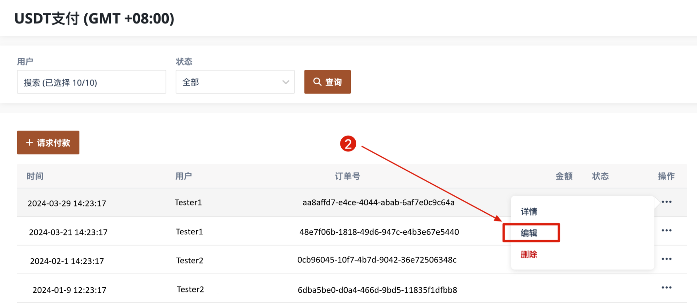

# Add new record

我们可以编辑处于[开启]状态的记录——这些记录是用户尚未确认付款的记录。:

# Step 1: Navigation Menu

First, navigate to the sidebar menu and click on the desired item to proceed.

# Step 2: Navigation Menu

Second, click add new record.

# Step 3: Input

Third, input.

After creating the record, it will be displayed on the user page.
记录创建后，将显示在用户页面上。
